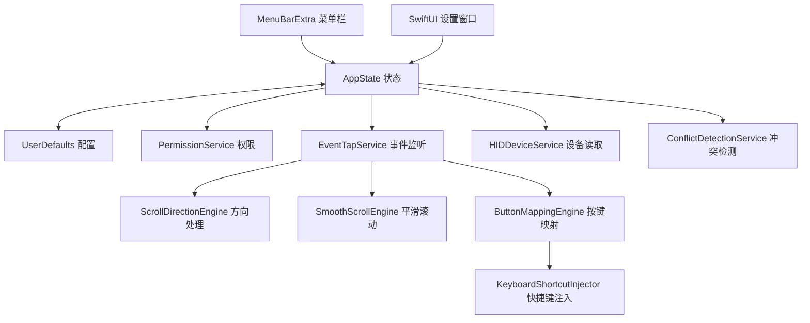

# Architecture

ScrollBridge 使用 SwiftUI（Swift 用户界面）加少量 AppKit（macOS 原生应用框架），核心分为四层。

## 关键约定

- 配置保存在 UserDefaults（用户默认配置）中，运行时使用 RuntimeConfigSnapshot（运行配置快照）。
- 配置包含排除 App 列表，事件入口按前台 bundle id（包标识）跳过处理。
- 权限与诊断页读取当前运行的常见鼠标工具，只显示冲突提示，不结束其他 App。
- 事件监听使用 CGEventTap（CoreGraphics 事件监听），缺少权限时不改写输入事件。
- 触控板通过 continuous scroll（连续滚动）特征跳过，默认只处理物理鼠标滚轮。
- 合成事件写入 eventSourceUserData（事件来源用户数据）标记，避免再次处理。
- 平滑滚动使用单一队列顺序发送，持续时间按步数拆成帧间隔，曲线控制每步滚动量分布，开启惯性模拟后追加短促递减尾段，队列过长时合并剩余滚动量。
- 事件监听被系统禁用后会延迟重试；连续异常达到阈值后停止重试并显示失败状态。
- 系统睡眠前暂停事件监听，唤醒后重新检测权限、设备和事件监听状态。
- 快捷键录制有 15 秒有效窗口，超时后需要重新录制；Esc（退出键）取消录制，Delete（删除键）清空当前快捷键。
- 快捷键注入按“修饰键按下、主键按下、主键抬起、修饰键抬起”的顺序发送。
- 日志不记录字符输入内容。
