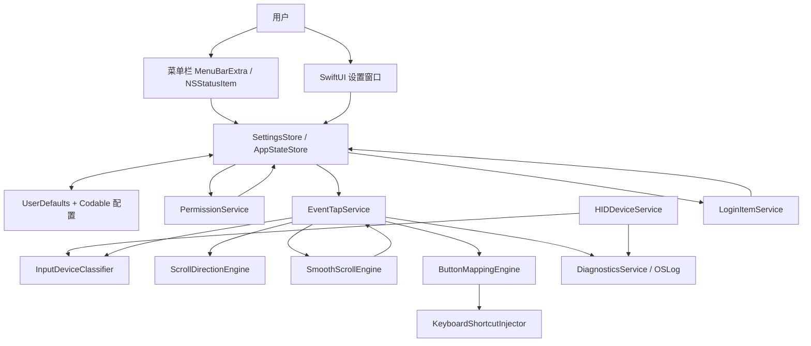
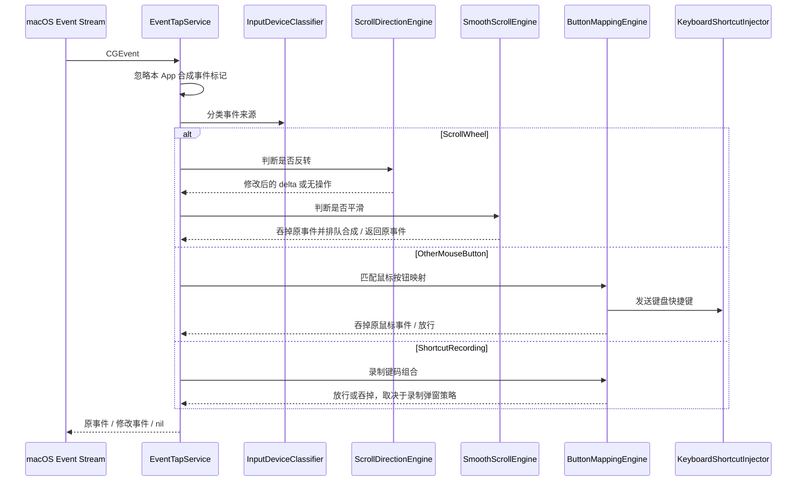

# macOS 原生鼠标方向同步与按键映射应用开发文档

版本：v1.0
日期：2026-06-18
目标平台：macOS 26 Tahoe 优先，Apple Silicon 与 Intel Mac 兼容
建议暂定代号：**ScrollBridge**，正式名称可后续替换
文档用途：交付给开发人员或开发模型，作为产品、架构、技术实现、验收测试和完成标准的统一约束。

---

## 1. 项目定位

本应用是一个 macOS 原生菜单栏工具，用于解决第三方鼠标在 macOS 上滚动方向、滚动手感和侧键映射体验不一致的问题。核心目标不是重写 macOS 输入系统，也不是提供一个完整的鼠标驱动，而是在用户授权的前提下，通过系统事件监听、事件过滤和合成输入，让普通鼠标在 macOS 中获得更接近 Windows 鼠标方向与 macOS 触控板顺滑滚动的体验。

应用必须以菜单栏常驻形式运行，用户点击菜单栏 icon 后可以快速打开设置、查看关于信息、退出应用。完整设置页面需要覆盖反转鼠标滚轮、鼠标按键映射快捷键、平滑滚动、开机自启和多语言设置。应用需要本地化支持，首期只支持简体中文、英文和跟随系统。

产品默认行为应为：保持触控板自然滚动体验不变，同时反转物理鼠标滚轮方向，使“触控板双指上拉”和“鼠标滚轮向下滚动”在页面滚动结果上保持一致。用户可以关闭该功能，也可以针对垂直方向、横向滚轮或具体设备进行进一步设置。第一版不要求云同步、账户系统、远程配置、驱动级内核扩展，也不要求覆盖游戏反作弊、虚拟机、远程桌面等特殊环境。

---

## 2. 官方依据与外部参考

### 2.1 Apple 官方技术依据

Apple 在 macOS 26 设计体系中引入并推广 Liquid Glass，官方文档说明导航元素和侧边栏可以位于 Liquid Glass 功能层中，形成浮于内容之上的界面层。SwiftUI 更新中也提供了 `glassEffect` 等相关能力。因此，本应用设置窗口应采用 SwiftUI 作为主 UI 技术，并在 macOS 26 上使用 Liquid Glass、悬浮侧边栏、系统圆角、系统材质和新版控件尺寸体系。
参考：Apple Developer - Adopting Liquid Glass：<https://developer.apple.com/documentation/TechnologyOverviews/adopting-liquid-glass>
参考：Apple HIG - Materials：<https://developer.apple.com/design/human-interface-guidelines/materials>
参考：WWDC25 - Get to know the new design system：<https://developer.apple.com/videos/play/wwdc2025/356/>

Apple 提供 `MenuBarExtra` 作为 SwiftUI 菜单栏额外项能力，适合实现状态栏 icon 与菜单；提供 `SMAppService` 用于 macOS 13 及之后版本注册和控制登录项；提供 `CGEventTap` / Quartz Event Services 用于监听和过滤输入事件；提供 `AXIsProcessTrustedWithOptions` 用于检测和引导辅助功能权限；提供 IOKit 的 `IOHIDManager` 进行 HID 设备发现、连接、移除和输入报告处理。
参考：MenuBarExtra：<https://developer.apple.com/documentation/SwiftUI/MenuBarExtra>
参考：SMAppService：<https://developer.apple.com/documentation/servicemanagement/smappservice>
参考：Quartz Event Services：<https://developer.apple.com/documentation/coregraphics/quartz-event-services>
参考：CGEvent.tapCreate：<https://developer.apple.com/documentation/coregraphics/cgevent/tapcreate(tap:place:options:eventsofinterest:callback:userinfo:)>
参考：AXIsProcessTrustedWithOptions：<https://developer.apple.com/documentation/applicationservices/1459186-axisprocesstrustedwithoptions>
参考：IOHIDManager：<https://developer.apple.com/documentation/iokit/iohidmanager_h>

Apple 用户指南说明，部分应用可以在用户使用其他 App 时监控键盘、鼠标或触控板，用户可以在系统设置的“隐私与安全性 > 输入监控”中授权或撤销此类能力。因此，本应用的权限设计必须将“输入监控”和“辅助功能”作为显式用户授权，不得静默绕过，也不得诱导用户误授权。
参考：Apple Support - Control access to input monitoring on Mac：<https://support.apple.com/guide/mac-help/control-access-to-input-monitoring-on-mac-mchl4cedafb6/mac>

多语言方面，Xcode String Catalog 是首选方案，可管理本地化字符串、复数和设备差异。设置保存可以使用 `UserDefaults` / `AppStorage`，状态管理可以使用 Swift Observation。测试方面，Swift Testing 适合业务逻辑单元测试，XCTest / XCUIAutomation 适合 UI 测试和性能测试。
参考：String Catalog：<https://developer.apple.com/documentation/xcode/localizing-and-varying-text-with-a-string-catalog>
参考：AppStorage：<https://developer.apple.com/documentation/SwiftUI/AppStorage>
参考：Observation：<https://developer.apple.com/documentation/observation>
参考：Swift Testing：<https://developer.apple.com/documentation/testing>
参考：XCTest：<https://developer.apple.com/documentation/xctest>

### 2.2 开源参考项目

以下项目不能直接照搬，但它们是本应用功能边界、交互方式和底层实现思路的重要参考。

| 项目 | 参考价值 | 链接 |
|---|---|---|
| Mac Mouse Fix | 鼠标侧键增强、平滑滚动、第三方鼠标体验优化、菜单栏控制、Apple Silicon 原生支持、权限与设备兼容问题 | <https://github.com/noah-nuebling/mac-mouse-fix> |
| Scroll Reverser | 独立配置鼠标和触控板滚动方向，使用事件 tap 访问滚动和手势事件，并通过手势判断触控板输入 | <https://github.com/pilotmoon/scroll-reverser> |
| Mos | 鼠标滚轮平滑滚动、滚动方向独立控制、按键改写、每个 App 单独配置、菜单栏工具形态 | <https://github.com/Caldis/Mos> |
| LinearMouse | 鼠标与触控板工具、自然滚动与鼠标反向设置、按键与滚动行为映射、较新的 macOS 兼容性参考 | <https://github.com/linearmouse/linearmouse> |
| Karabiner-Elements | 键盘事件重映射、复杂输入设备权限、签名、后台服务、macOS 26 支持和大型输入工具工程结构 | <https://github.com/pqrs-org/Karabiner-Elements> |

特别注意：Scroll Reverser 的 README 明确说明其核心逻辑位于 `MouseTap.m`，通过事件 tap 访问滚动事件和手势事件，并通过“是否有两指及以上触控板手势”推断输入来源。该思路可以作为本应用第一版区分触控板与物理鼠标的参考，但不能作为唯一判断。Mos 的 README 说明其会拦截鼠标滚轮事件并将原始 delta 转换为更平滑的滚动，同时支持方向、轴和按键行为设置。Mac Mouse Fix 说明部分 Logitech 等专有协议鼠标可能存在按钮识别限制，这一点必须写入本应用的兼容性说明。

---

## 3. 产品目标与非目标

### 3.1 产品目标

本应用第一版必须达到以下目标。

第一，用户安装并打开后，菜单栏出现应用 icon。点击 icon 后显示菜单，菜单至少包含“打开设置”“关于 ScrollBridge”“退出 ScrollBridge”。权限未满足时，菜单中还应显示“需要权限”状态和“打开权限引导”。

第二，用户进入设置后，可以看到所有核心功能开关：总开关、反转鼠标滚轮、鼠标按键映射、平滑滚动、开机自启、语言选择。设置页面需要能保存并立即生效，不要求重启应用。

第三，反转鼠标滚轮功能必须只影响被识别为物理鼠标滚轮的输入，不应改变触控板双指滚动方向。默认配置应满足“触控板保持自然滚动，鼠标滚轮使用 Windows 方向”的体验。

第四，鼠标侧键映射必须支持至少 Button 3、Button 4、Button 5 及常见扩展鼠标按钮。每个鼠标按键只能绑定一个键盘按键或一个键盘快捷键；同一个键盘按键或快捷键允许被多个鼠标按键复用。用户可以录制快捷键，例如 `Command + C`、`Command + V`、`Command + [`、`Control + Left Arrow`。

第五，平滑滚动必须支持开关和“平滑步数”设置。平滑步数用于控制每次物理滚轮刻度被拆分为多少个合成像素滚动事件，建议范围 1 到 20，默认 8。后续可增加持续时间、曲线、速度倍率、横向滚动单独控制，但第一版至少需要步数设置。

第六，开机自启必须通过系统推荐方式实现，用户主动开启后才能注册登录项。应用不得默认开启自启。

第七，应用必须支持简体中文、英文、跟随系统三种语言模式。语言切换后设置窗口和菜单栏菜单应及时刷新，允许需要重开设置窗口，但不允许要求用户重启电脑。

第八，应用必须提供权限状态页面，显示输入监控、辅助功能、开机自启、事件 tap 状态、当前已识别设备和最近一次错误。

### 3.2 非目标

第一版不实现云同步、用户账户、付费、自动更新、插件市场、配置分享、配置导入导出、游戏专用宏、脚本执行、复杂手势、鼠标移动轨迹映射、DPI/指针加速度深度修改、内核扩展、DriverKit 虚拟 HID 驱动。

第一版不承诺识别所有 Logitech、Razer、SteelSeries 等厂商的专有按钮。只保证标准 HID 鼠标按钮在系统事件层可见时可被捕获。若按钮被厂商驱动拦截或以专有协议上报，应在 UI 中提示“不支持或需要关闭厂商驱动后重试”。

第一版不采集用户输入内容，不记录键盘字符，不上传事件日志，不存储剪贴板内容。快捷键录制只保存虚拟键码、修饰键和展示名称，不保存字符输入序列。

---

## 4. 用户体验设计

### 4.1 应用信息架构

应用由三部分组成：菜单栏菜单、设置窗口、权限引导与诊断窗口。菜单栏菜单用于快速入口和退出；设置窗口用于完整配置；权限引导与诊断可以作为设置页内的独立页面，也可以在首次启动时以独立 sheet 展示。

设置窗口采用 macOS 26 风格：窗口内容使用 SwiftUI，左侧使用悬浮侧边栏，右侧为设置详情。窗口尺寸建议为 820 × 560，最小尺寸 760 × 500。页面布局应使用系统 `NavigationSplitView`、`Form`、`List`、`Section`、`Toggle`、`Slider`、`Picker`、`Table` 等原生控件。macOS 26 可用时，对侧边栏、权限卡片、顶部提示条和主要操作按钮使用 Liquid Glass 相关效果；不可用时退化为标准 material / grouped form。

### 4.2 菜单栏 icon 与菜单

菜单栏 icon 应使用 SF Symbols 风格或自定义模板图标，建议使用“鼠标 + 滚轮方向”抽象图形。图标必须支持浅色、深色、强调色和透明菜单栏背景。状态变化可以通过图标状态体现，但不要过度复杂。

菜单结构如下。

```text
ScrollBridge
────────────────────────
状态：已启用 / 已暂停 / 缺少权限
反转鼠标滚轮            ✓
平滑滚动                ✓
鼠标按键映射            ✓
────────────────────────
打开设置…
权限与诊断…
关于 ScrollBridge
────────────────────────
退出 ScrollBridge
```

菜单行为要求如下。

“状态”只展示，不可点击。若缺少输入监控或辅助功能权限，状态显示为“缺少权限”，并在其下方展示“打开权限引导…”。“反转鼠标滚轮”“平滑滚动”“鼠标按键映射”可作为快速开关，切换后立即写入配置并重载事件处理器。“打开设置…”打开设置窗口并使应用成为前台。“权限与诊断…”打开设置窗口并定位到“权限与诊断”页面。“关于 ScrollBridge”显示关于窗口，包含版本、构建号、版权、开源许可和隐私说明。“退出 ScrollBridge”必须可用，因为菜单栏 App 可能不在 Dock 中显示。

推荐实现方式是首选 SwiftUI `MenuBarExtra`，并使用 SwiftUI App 生命周期；若需要更精细的右键菜单、动态状态图标或窗口激活控制，可封装一个 `StatusItemController` 使用 AppKit `NSStatusItem`。第一版建议从 `MenuBarExtra` 起步，遇到设置窗口置顶、激活失败或菜单控制不足时再替换为 AppKit 桥接。

### 4.3 首次启动体验

首次启动不直接启用事件拦截，而是进入“欢迎与权限检查”流程。

第一屏说明应用用途：同步鼠标与触控板滚动方向、映射鼠标侧键、让鼠标滚动更顺滑。第二屏说明权限：输入监控用于识别鼠标和键盘事件；辅助功能用于过滤、改写和合成用户指定的输入事件；开机自启是可选项，默认关闭。第三屏提供按钮“打开输入监控设置”“打开辅助功能设置”“我已授权，重新检测”。第四屏进入设置主页。

所有权限文案必须强调本应用只在本机处理输入事件，不上传、不保存键入文本、不读取剪贴板。权限未满足时，核心功能开关可显示但不可真正生效，页面应显示明确原因。

### 4.4 设置窗口结构

设置页使用左侧导航，建议如下。

```text
通用
滚动方向
平滑滚动
按键映射
设备
权限与诊断
关于
```

“通用”页面包含总开关、开机自启、语言、菜单栏显示、启动时显示设置窗口、恢复默认设置。总开关关闭时，事件 tap 应停止或转为 listen-only 诊断模式，不应继续改写任何输入事件。

“滚动方向”页面包含反转鼠标滚轮总开关、垂直滚动反转、水平滚动反转、仅物理滚轮生效、触控板保持系统方向、Magic Mouse 处理策略、每个设备的覆盖设置。默认策略为物理鼠标垂直滚动反转，触控板不处理，Magic Mouse 默认不处理并提示其更接近触控板设备。

“平滑滚动”页面包含平滑滚动开关、平滑步数、滚动持续时间、滚动曲线、速度倍率、水平滚动是否平滑、滚动惯性模拟、排除 App 列表。第一版必须实现平滑步数，建议同时预留持续时间和速度倍率的数据模型。平滑步数为 1 时代表接近原始滚动；推荐默认值为 8；范围为 1 到 20；用户调节时右侧显示“更直接 / 均衡 / 更柔和”。

“按键映射”页面包含映射列表、添加映射、编辑映射、删除映射、临时录制按钮、冲突提示。列表字段包括启用状态、鼠标按钮、目标快捷键、作用范围、备注。作用范围第一版可以只支持全局；如果实现不复杂，可以预留“所有 App / 指定 App / 排除 App”。添加映射流程为：点击“添加映射”后，进入录制弹窗；第一步要求用户按下一个鼠标按钮；第二步要求用户按下目标键或快捷键；第三步确认名称和启用状态。

“设备”页面显示当前识别到的鼠标、触控板、键盘和未知 HID 设备。每个设备显示名称、厂商 ID、产品 ID、传输方式、是否标准 HID、最近一次事件时间、当前分类。用户可以手动将设备标记为鼠标、触控板、Magic Mouse、忽略。设备手动覆盖是解决分类误判的必要能力。

“权限与诊断”页面显示输入监控权限、辅助功能权限、登录项状态、事件 tap 状态、最近一次事件 tap 被系统禁用原因、最近 20 条非敏感日志、重置权限说明、导出诊断包。诊断包不得包含用户按键字符，只能包含配置摘要、设备标识、系统版本、App 版本、权限状态、错误码和性能统计。

“关于”页面包含 App 图标、名称、版本、构建号、Git commit、开源许可、隐私承诺、参考项目致谢。

### 4.5 多语言策略

语言选项为“跟随系统”“简体中文”“English”。内部枚举如下。

```swift
enum AppLanguage: String, Codable, CaseIterable {
    case system
    case zhHans
    case en
}
```

文案必须全部进入 String Catalog，不允许在业务代码中散落硬编码中文或英文。快捷键展示中的修饰键符号可以使用 macOS 常见符号：Command 显示为 `⌘`，Option 显示为 `⌥`，Control 显示为 `⌃`，Shift 显示为 `⇧`。中文界面中可显示“⌘C”，英文界面中可显示“Command-C”或“⌘C”，但同一界面必须统一。

---

## 5. 推荐技术栈

### 5.1 总体技术选型

| 领域 | 推荐技术 | 说明 |
|---|---|---|
| 主语言 | Swift 6.x | 使用严格并发检查，减少共享状态错误 |
| UI | SwiftUI + 少量 AppKit | 设置窗口、菜单、状态管理使用 SwiftUI；状态栏和窗口激活必要时用 AppKit 桥接 |
| macOS 26 UI | Liquid Glass、NavigationSplitView、系统 Material、SF Symbols | 遵循官方设计语言，不自绘大量控件 |
| 输入监听与过滤 | CoreGraphics / Quartz Event Services / CGEventTap | 监听、过滤、修改滚轮、鼠标按键、键盘事件 |
| 设备识别 | IOKit / IOHIDManager | 识别鼠标、触控板、键盘、厂商/产品 ID、设备插拔 |
| 辅助功能权限 | ApplicationServices / AXIsProcessTrustedWithOptions | 检测并引导辅助功能授权 |
| 输入监控权限 | CGPreflightListenEventAccess / CGRequestListenEventAccess | 检测并请求输入监控权限，实际可用性需按系统版本验证 |
| 开机自启 | ServiceManagement / SMAppService | 用户主动开启后注册 Login Item |
| 设置存储 | UserDefaults + Codable JSON | 小型本地配置足够，不需要数据库 |
| 状态管理 | Observation `@Observable` + `@MainActor` | UI 状态和服务状态分离 |
| 日志 | OSLog / Logger | 使用系统统一日志，禁止 print 调试散落在正式代码 |
| 测试 | Swift Testing + XCTest + XCUIAutomation | 业务逻辑、事件转换、UI、本地化和性能测试 |
| 依赖管理 | Swift Package Manager | 减少外部依赖，保持原生轻量 |

### 5.2 不推荐技术

不推荐 Electron、Tauri、Flutter、React Native、Python 后台常驻进程、Node.js 服务、内核扩展、未签名 helper、私有 API、ScriptingBridge 滥用、AppleScript 控制其他 App。该应用核心是低延迟输入处理，必须原生、轻量、可签名、可公证。

不推荐一开始引入复杂数据库。配置量很小，`UserDefaults` 加 Codable 足够。若未来支持配置备份和导入导出，可以增加 JSON 文件导入导出，而不是引入 SQLite。

不推荐把所有输入事件都放进 SwiftUI 状态流。事件 tap 回调频率高，必须走低延迟服务层；SwiftUI 只读取服务层产生的状态快照。

---

## 6. 系统架构

### 6.1 分层架构

应用采用“App Shell + Core Services + Data Store + Platform Adapters”的架构。



### 6.2 核心模块职责

`AppShell` 负责 SwiftUI App 生命周期、菜单栏场景、设置窗口场景、AppDelegate 桥接和全局依赖注入。它不直接处理输入事件，只负责启动服务和绑定状态。

`StatusMenuController` 负责菜单栏状态展示、快速开关、打开设置、打开权限诊断、关于窗口和退出应用。第一版可以用 `MenuBarExtra` 实现；若需要更复杂交互，可以迁移为 AppKit `NSStatusItem`。

`SettingsStore` 是 UI 可观察状态源。它保存当前设置、权限状态、设备列表、事件 tap 状态和诊断状态。它可以使用 `@Observable`，并标记为 `@MainActor`，但不得被事件 tap 回调直接频繁写入。

`ConfigurationStore` 负责读取、写入、迁移配置。配置使用版本化 Codable 模型，保存到 `UserDefaults`。每次配置变化后，生成一个不可变 `RuntimeConfigSnapshot` 提交给事件处理层。

`PermissionService` 负责检查输入监控、辅助功能、登录项状态，并提供打开系统设置的能力。它必须清晰区分“未授权”“已授权”“需要重启 App 生效”“未知状态”。

`HIDDeviceService` 负责监听 HID 设备连接和移除，读取设备名称、厂商 ID、产品 ID、usage page、usage、transport 等信息，并维护设备分类候选。该模块不负责改写事件。

`InputDeviceClassifier` 负责判断当前事件来源是物理鼠标、触控板、Magic Mouse、键盘还是未知设备。它应融合 HID 设备信息、CGEvent 字段、滚动精度、手势阶段、最近触控板手势状态和用户手动覆盖设置。

`EventTapService` 是底层事件入口。它创建、启用、禁用、重启 CGEventTap，接收滚轮、鼠标按钮、键盘事件，并将事件交给各引擎处理。事件 tap 回调必须足够短，禁止进行磁盘 I/O、网络 I/O、复杂日志、UI 更新、长时间锁等待。

`ScrollDirectionEngine` 负责滚动方向反转。它只处理被分类为物理鼠标的滚动事件。它根据配置反转垂直轴和水平轴，并返回修改后的事件或指示上层吞掉原事件。

`SmoothScrollEngine` 负责平滑滚动。它将粗糙的物理滚轮刻度转换为多段像素滚动事件。该模块应维护每个滚动轴的缓冲队列、速度、剩余 delta、定时器和节流策略。

`ButtonMappingEngine` 负责鼠标按键到键盘快捷键的映射。它接收 `otherMouseDown` / `otherMouseUp` 事件，判断是否命中映射，并决定是否吞掉原始鼠标事件。

`KeyboardShortcutInjector` 负责合成键盘事件。它必须按正确顺序发送修饰键 down、主键 down、主键 up、修饰键 up。它需要给合成事件打标记，防止被事件 tap 再次处理。

`LoginItemService` 负责开机自启注册和注销，使用 `SMAppService`。若采用主 App 自启，可用 `SMAppService.mainApp`；若未来拆分 helper，使用 login item bundle identifier。

`DiagnosticsService` 负责非敏感日志、性能统计和诊断导出。它只能记录事件类型、设备 ID、错误码、耗时和状态，不得记录用户输入字符。

### 6.3 目录结构建议

```text
ScrollBridge/
  App/
    ScrollBridgeApp.swift
    AppDelegate.swift
    AppEnvironment.swift
  UI/
    MenuBar/
      StatusMenuView.swift
      StatusMenuController.swift
    Settings/
      SettingsWindow.swift
      GeneralSettingsView.swift
      ScrollDirectionSettingsView.swift
      SmoothScrollSettingsView.swift
      ButtonMappingSettingsView.swift
      DeviceSettingsView.swift
      PermissionDiagnosticsView.swift
      AboutView.swift
    Components/
      PermissionCard.swift
      GlassCard.swift
      ShortcutRecorderView.swift
      DeviceRowView.swift
  Core/
    Permissions/
      PermissionService.swift
      PermissionStatus.swift
    EventTap/
      EventTapService.swift
      EventTapCallbackBridge.swift
      EventMaskBuilder.swift
      RuntimeEvent.swift
    HID/
      HIDDeviceService.swift
      HIDDeviceInfo.swift
      HIDUsage.swift
    Classification/
      InputDeviceClassifier.swift
      DeviceClassification.swift
    Scroll/
      ScrollDirectionEngine.swift
      SmoothScrollEngine.swift
      SmoothScrollScheduler.swift
      ScrollEventFactory.swift
    Mapping/
      ButtonMappingEngine.swift
      ShortcutRecorder.swift
      KeyboardShortcutInjector.swift
      KeyCodeMap.swift
    LoginItem/
      LoginItemService.swift
    Diagnostics/
      DiagnosticsService.swift
      PerformanceCounter.swift
  Data/
    ConfigurationStore.swift
    AppSettings.swift
    RuntimeConfigSnapshot.swift
    Migration/
      SettingsMigrationV1.swift
  Localization/
    Localizable.xcstrings
  Tests/
    CoreTests/
    UITests/
```

---

## 7. 权限与安全设计

### 7.1 权限矩阵

| 功能 | 输入监控 | 辅助功能 | 开机自启 | 说明 |
|---|---:|---:|---:|---|
| 查看菜单栏状态 | 否 | 否 | 否 | 无需权限 |
| 打开设置与修改配置 | 否 | 否 | 否 | 无需权限 |
| 监听全局鼠标滚轮 | 是 | 可能需要 | 否 | 使用 CGEventTap 时重点检查输入监控权限 |
| 拦截并反转滚轮 | 是 | 是 | 否 | 需要过滤或替换事件，实际系统上必须同时验证 |
| 平滑滚动并合成滚动事件 | 是 | 是 | 否 | 需要吞掉原事件并发送合成滚动事件 |
| 捕获鼠标侧键 | 是 | 可能需要 | 否 | 标准 HID 鼠标按钮通常通过 CGEventTap 捕获 |
| 发送 Command+C 等快捷键 | 否 | 是 | 否 | 合成对其他 App 生效的键盘事件需要辅助功能授权 |
| 开机启动 | 否 | 否 | 是 | 用户主动开启后通过 SMAppService 注册 |

权限实现必须按能力分层。输入监控用于“看见事件”，辅助功能用于“改变或注入事件”。如果系统版本或签名方式导致某个权限检查结果与预期不一致，必须在权限页展示可操作说明，而不是让功能静默失效。

### 7.2 权限引导原则

权限引导文案必须说明每个权限为什么需要。不得使用“必须授予全部权限否则无法运行”这种笼统文案。更合适的文案如下。

输入监控：ScrollBridge 需要识别鼠标滚轮、鼠标侧键和快捷键录制事件。输入事件只在本机处理，不会上传或保存键入文本。

辅助功能：ScrollBridge 需要在你启用反转滚轮、平滑滚动或鼠标按键映射时，拦截原始输入并发送你指定的替代输入。应用不会控制你的窗口内容，也不会读取屏幕文字。

开机自启：开启后，ScrollBridge 会在你登录 macOS 时自动启动。该功能默认关闭，可随时关闭。

### 7.3 隐私与数据边界

应用不得记录完整键盘输入。快捷键录制只允许在用户主动点击“录制快捷键”后的短时间窗口内记录键码组合，并且只保存最终的快捷键定义，不保存录制过程中的字符序列。

应用不得上传任何输入事件、设备列表或诊断日志。第一版不需要网络权限。若未来加入更新检查，也必须与输入处理模块隔离，并在隐私说明中单独列出。

诊断日志必须脱敏。设备信息可以保存 vendor ID、product ID、设备名称和分类，但不保存序列号，除非用户主动开启高级诊断并明确同意。

### 7.4 App Store 与分发建议

该类 App 涉及全局输入监听、事件过滤和事件合成。若走 Mac App Store，审核不确定性较高，且沙盒与辅助功能能力可能带来额外限制。第一版建议采用 Developer ID 签名 + Notarization 分发，确保用户安装时没有安全警告，并保留未来上架 Mac App Store 的可选路径。

如果必须支持 Mac App Store，应在开发早期单独建立 MAS 分支，验证 sandbox、CGEventTap、Input Monitoring、Accessibility 和合成事件在沙盒环境中的真实可用性，不应等核心功能完成后再处理审核和沙盒问题。

---

## 8. 输入事件处理设计

### 8.1 事件 tap 生命周期

`EventTapService` 负责创建 session event tap。建议使用 `.cgSessionEventTap`，插入位置使用 `.headInsertEventTap`。当只观察事件时使用 `.listenOnly`，当需要修改、吞掉或替换事件时使用默认 active filter 选项。

监听事件类型至少包括：

```swift
CGEventType.scrollWheel
CGEventType.otherMouseDown
CGEventType.otherMouseUp
CGEventType.keyDown
CGEventType.keyUp
CGEventType.flagsChanged
```

`keyDown`、`keyUp`、`flagsChanged` 主要用于快捷键录制，不应在非录制状态下做任何内容级处理。鼠标移动事件默认不监听，避免无必要高频开销。

事件 tap 必须处理被系统禁用的情况。若收到 `tapDisabledByTimeout` 或 `tapDisabledByUserInput`，应记录诊断状态，并在安全延迟后尝试重新启用。若连续失败超过阈值，例如 3 次，应停止重试并在菜单栏显示“事件监听异常”。

### 8.2 事件处理链

事件处理链遵循以下顺序。



处理链原则是：先识别是否为本应用合成事件；若是，直接放行，不再二次处理。滚轮事件先做方向处理，再做平滑处理。鼠标按钮事件只进入按键映射，不进入滚动处理。快捷键录制必须有明确 UI 状态开关，防止 App 在后台持续记录键盘事件。

### 8.3 设备分类策略

区分触控板与鼠标是本应用的关键难点。不能只依赖一个字段。建议使用四层分类策略。

第一层是用户手动覆盖。只要用户在设备页将某个设备标记为“鼠标”“触控板”“忽略”，后续分类优先使用该设置。

第二层是 IOKit 设备信息。通过 `IOHIDManager` 获取 usage page、usage、vendor ID、product ID、transport 和设备名称。标准 USB/Bluetooth 鼠标通常可以识别为 Generic Desktop Mouse。内置触控板、Magic Trackpad 和 Magic Mouse 需要按名称、usage 和滚动特征综合判断。

第三层是滚动事件特征。物理滚轮通常是非连续的 coarse delta，触控板和 Magic Mouse 往往具有 precise / continuous / phase / momentum 特征。AppKit 的 `NSEvent.hasPreciseScrollingDeltas` 可作为理解参考，CoreGraphics 侧可读取相应 scroll wheel 字段。该层只能作为概率判断，因为部分高端鼠标也可能产生高精度滚动。

第四层是手势事件或最近触控状态。Scroll Reverser 的实现思路表明，可以通过事件 tap 访问滚动事件和手势事件，并在检测到两指及以上触控板手势时推断滚动来自触控板。该思路应作为 fallback，用于无法直接绑定设备 ID 的系统版本。

最终分类结果应包含置信度。

```swift
enum InputDeviceKind: String, Codable {
    case physicalMouse
    case trackpad
    case magicMouse
    case keyboard
    case unknown
    case ignored
}

struct DeviceClassificationResult {
    let kind: InputDeviceKind
    let confidence: Double
    let source: ClassificationSource
}
```

当置信度低于阈值，例如 0.65，应在设备页显示“可能是鼠标 / 需要确认”，并允许用户手动标记。反转滚动默认只对高置信度的物理鼠标生效，避免误伤触控板。

### 8.4 鼠标滚轮反转

反转逻辑必须明确区分“事件物理方向”和“页面视觉结果”。本应用默认目标是让用户在 macOS 中使用触控板时保持自然滚动，同时让普通鼠标滚轮方向符合 Windows 习惯。实现上，应在识别为物理鼠标滚轮时，将垂直滚动 delta 乘以 `-1`。若启用水平反转，则水平轴也乘以 `-1`。

伪代码如下。

```swift
func processScrollDirection(_ event: ScrollEvent, config: RuntimeConfigSnapshot) -> ScrollDecision {
    guard config.reverseScroll.enabled else { return .pass(event) }
    guard event.deviceKind == .physicalMouse else { return .pass(event) }

    var next = event
    if config.reverseScroll.vertical { next.deltaY *= -1 }
    if config.reverseScroll.horizontal { next.deltaX *= -1 }
    return .replace(next)
}
```

不要修改触控板滚动，也不要修改由本应用合成的滚动事件。否则会出现方向反复翻转或滚动抖动。

### 8.5 平滑滚动

平滑滚动的实现目标是把物理滚轮的一次粗颗粒输入拆成多个更小的像素滚动事件，并在短时间内连续发送。第一版建议使用“步数 + 持续时间 + 曲线”的模型，但 UI 至少暴露步数。

配置模型如下。

```swift
struct SmoothScrollSettings: Codable, Equatable {
    var enabled: Bool = true
    var steps: Int = 8              // 1...20
    var durationMs: Int = 120       // 40...240，可先隐藏高级设置
    var multiplier: Double = 1.0    // 0.25...3.0，可先隐藏高级设置
    var curve: SmoothCurve = .easeOut
    var horizontalEnabled: Bool = true
}
```

推荐算法如下。收到物理鼠标滚轮事件后，先应用方向反转，再判断是否需要平滑。如果平滑关闭，直接返回修改后的事件。如果平滑开启，吞掉原始事件，将 delta 转换为像素单位，然后根据 `steps` 生成多个小 delta。使用 `DispatchSourceTimer` 或主运行循环外的专用调度器，以 60Hz 左右节奏发送合成事件。合成事件必须设置本应用标记，避免重新进入处理链。

平滑滚动必须考虑连续滚轮输入叠加。如果用户快速滚轮多次，不能简单启动多个独立定时器，否则会抖动和堆积。正确做法是维护轴向 accumulator，将新 delta 合并到当前滚动动画中，并按当前速度平滑释放。

关键性能要求：事件 tap 回调中只入队，不做定时等待；定时器只在有待发送 delta 时运行；队列为空后立即停止定时器；合成事件频率不得无限制提高；CPU 空闲占用应接近 0。

### 8.6 鼠标按钮映射

鼠标按钮映射使用 `otherMouseDown` / `otherMouseUp` 作为主要入口。常见侧键通常表现为 button number 3、4、5 或更高。左键和右键默认不允许映射，避免用户误操作导致系统不可用。中键允许映射，但应给出风险提示。

数据模型如下。

```swift
struct ButtonMapping: Codable, Identifiable, Equatable {
    var id: UUID
    var isEnabled: Bool
    var trigger: MouseButtonTrigger
    var action: KeyboardShortcutAction
    var scope: MappingScope
    var note: String?
}

struct MouseButtonTrigger: Codable, Hashable {
    var buttonNumber: Int
    var deviceID: String?       // nil 表示所有鼠标
    var eventKind: TriggerEventKind = .click
}

struct KeyboardShortcutAction: Codable, Hashable {
    var keyCode: UInt16
    var modifiers: ModifierFlags
    var displayName: String
}
```

映射规则如下。

一个 `MouseButtonTrigger` 只能绑定一个 `KeyboardShortcutAction`。保存时若发现同一设备、同一 button number、同一触发方式已有启用映射，应提示用户覆盖或取消。

一个 `KeyboardShortcutAction` 可以被多个 `MouseButtonTrigger` 复用。例如 Button 4 和 Button 5 都可以映射为 `Command + C`，这满足“1 个键盘快捷键可对应 n 个鼠标按键”的需求。

按键注入顺序必须正确。例如 `Command + C`：先发送 Command down，再发送 C down，再发送 C up，最后发送 Command up。若多个修饰键存在，down 顺序建议为 Control、Option、Shift、Command，up 顺序相反。每个事件必须带上合成标记。

用户录制快捷键时，弹窗需要显示当前捕获到的组合，并提供“重新录制”“保存”“取消”。录制过程中按下 Esc 取消，按 Delete 清空，按单个字母或修饰键组合保存为目标快捷键。单独修饰键作为目标动作是否允许应作为高级选项，第一版建议不允许单独保存纯修饰键，除非明确支持“按住模式”。

### 8.7 防止递归和冲突

合成事件可能被本应用自己的 event tap 再次捕获，因此必须设置事件源标记。可使用固定 magic number 写入事件 source user data 或其他可用事件字段，并在事件 tap 入口先判断该标记。若系统不保留该字段，需要维护短时间内合成事件指纹缓存作为 fallback。

需要处理与其他工具冲突。若用户同时运行 Logi Options+、Karabiner-Elements、BetterTouchTool、Mos、Mac Mouse Fix、LinearMouse 等输入工具，可能出现双重反转、双重平滑、按键被其他工具先拦截。应用应在诊断页显示“检测到可能冲突的进程”作为提示，但不应强行关闭其他工具。

---

## 9. 配置模型与持久化

### 9.1 总配置模型

配置必须版本化，便于后续迁移。

```swift
struct AppSettings: Codable, Equatable {
    var schemaVersion: Int = 1
    var appEnabled: Bool = true
    var language: AppLanguage = .system
    var launchAtLogin: Bool = false
    var showMenuBarIcon: Bool = true
    var reverseScroll: ReverseScrollSettings = .default
    var smoothScroll: SmoothScrollSettings = .default
    var mappings: [ButtonMapping] = []
    var devices: [DeviceOverride] = []
    var excludedApps: [AppIdentifier] = []
}
```

### 9.2 运行时快照

事件处理层不得直接读取 `UserDefaults` 或 UI store。每次设置变化后，生成不可变快照。

```swift
struct RuntimeConfigSnapshot: Sendable {
    let appEnabled: Bool
    let reverseScroll: ReverseScrollRuntime
    let smoothScroll: SmoothScrollRuntime
    let mappings: [MouseButtonTrigger: KeyboardShortcutAction]
    let deviceOverrides: [DeviceID: InputDeviceKind]
    let excludedBundleIDs: Set<String>
}
```

`RuntimeConfigSnapshot` 必须可安全跨线程读取。事件 tap 使用原子引用或读写锁读取最新快照，不能在回调中等待 MainActor。

### 9.3 存储位置

第一版使用 `UserDefaults.standard` 保存配置。复杂数组可以编码为 JSON Data 后保存。设备列表和映射列表同样通过 Codable 保存。若未来拆分 Login Item helper，并需要主 App 与 helper 共享配置，则迁移到 App Group UserDefaults。

### 9.4 配置迁移

每次 App 启动后读取配置，检查 `schemaVersion`。若低于当前版本，按顺序执行迁移。迁移必须有单元测试，确保旧配置不会导致用户映射丢失。迁移失败时，应备份原始配置并回退默认配置，同时在诊断页显示错误。

---

## 10. macOS 26 UI 设计规范

### 10.1 总体原则

设置窗口必须符合 macOS 原生应用气质：密度适中、层级清晰、系统控件优先、少自绘。Liquid Glass 应用于导航、卡片和重点控制，不应把所有背景都做成高透明玻璃。对于辅助功能中的“降低透明度”“增强对比度”，界面必须自动退化为更清晰的实色或系统 material，不能牺牲可读性。

### 10.2 悬浮侧边栏

设置窗口左侧使用 `NavigationSplitView`。macOS 26 可用时侧边栏使用 Liquid Glass 背景，视觉上与右侧内容形成层级分离。侧边栏 item 包含 SF Symbol 和本地化标题。当前选中项使用系统 selection 样式，不自定义大面积高饱和颜色。

导航项建议如下。

| 页面 | SF Symbol 建议 | 说明 |
|---|---|---|
| 通用 | `gearshape` | 总开关、语言、自启 |
| 滚动方向 | `arrow.up.arrow.down.circle` | 方向反转 |
| 平滑滚动 | `waveform.path` | 平滑步数、速度、曲线 |
| 按键映射 | `keyboard` 或 `cursorarrow.click` | 鼠标按钮到快捷键 |
| 设备 | `computermouse` | 已识别设备与覆盖分类 |
| 权限与诊断 | `lock.shield` | 权限、事件 tap、日志 |
| 关于 | `info.circle` | 版本与隐私 |

### 10.3 Liquid Glass 使用边界

可以使用 Liquid Glass 的位置：设置窗口侧边栏、页面顶部状态卡片、权限引导卡片、主要操作按钮背景、关于页 App 图标容器。

不建议使用 Liquid Glass 的位置：长列表每一行、表格每个单元格、日志文本背景、密集表单控件内部。过度使用会降低可读性并增加视觉噪声。

示意写法如下。

```swift
@ViewBuilder
func glassCard<Content: View>(@ViewBuilder content: () -> Content) -> some View {
    if #available(macOS 26.0, *) {
        content()
            .padding(16)
            .glassEffect(.regular, in: .rect(cornerRadius: 20))
    } else {
        content()
            .padding(16)
            .background(.regularMaterial, in: RoundedRectangle(cornerRadius: 16))
    }
}
```

开发时必须用 availability guard，避免使用 macOS 26 API 后无法在更低系统运行。如果产品明确只支持 macOS 26，可以减少兼容分支，但仍建议保留抽象层。

### 10.4 About 窗口

关于窗口可以使用 SwiftUI 独立窗口或 `NSWindow` 包装。内容必须包含：App 图标、App 名称、版本号、构建号、版权、隐私说明、开源项目致谢、检查更新入口占位。若第一版无自动更新，不显示不可用按钮。

### 10.5 Accessibility UI

设置窗口本身必须支持 VoiceOver。所有 Toggle、Slider、Button、Table row 都需要有可理解的 label 和 hint。快捷键录制弹窗必须提供键盘可操作路径，不能只依赖鼠标点击。

---

## 11. 开机自启设计

开机自启默认关闭。用户在“通用”页面打开“登录时启动 ScrollBridge”后，调用 `SMAppService` 注册。关闭时注销。注册成功后刷新状态；失败时显示错误原因。

如果第一版只需要主 App 自启，可使用主 App 作为登录项，不必拆分 helper。如果未来希望后台服务在无设置窗口时更稳定运行，可以拆分 login item helper，但会增加签名、权限、配置共享和更新复杂度。第一版不建议拆分。

验收要求：开启自启后重启或注销再登录，App 出现在菜单栏；关闭自启后再次登录不自动启动；用户从系统设置中手动关闭登录项后，App 内状态能识别为关闭或未知。

---

## 12. 错误处理与诊断

### 12.1 错误分类

错误应分为以下类型。

权限错误：输入监控未授权、辅助功能未授权、权限已授予但需要重启 App、生效状态未知。

事件 tap 错误：创建失败、被用户输入禁用、因超时被系统禁用、run loop source 创建失败、连续重启失败。

设备错误：无法读取 HID 属性、设备分类低置信度、设备移除、设备被厂商驱动拦截。

映射错误：快捷键无效、触发器冲突、目标按键无法合成、当前 App 排除。

平滑滚动错误：合成事件发送失败、队列积压、定时器异常。

### 12.2 日志规范

使用 `Logger(subsystem: "com.company.ScrollBridge", category: "EventTap")` 这类分类日志。日志中禁止出现字符输入内容。允许记录 keyCode 和 modifier rawValue，但不记录实际文本。Debug 构建可以增加更详细日志，Release 构建默认只保留必要状态和错误。

### 12.3 用户可见诊断

诊断页应显示以下信息。

```text
App 版本：1.0.0 (100)
macOS：26.x
架构：arm64 / x86_64
输入监控：已授权 / 未授权 / 未知
辅助功能：已授权 / 未授权 / 未知
事件监听：运行中 / 已暂停 / 创建失败 / 被系统禁用
已识别设备：3
最近事件：物理鼠标滚轮，12 秒前
最近错误：无
```

导出诊断包时生成本地 JSON 或 zip，内容只包含非敏感信息。导出必须由用户主动点击。

---

## 13. 性能与可靠性要求

事件 tap 回调是全局输入路径的一部分，任何卡顿都会直接影响用户鼠标和键盘体验。必须制定性能约束。

事件 tap 回调平均耗时应低于 1 ms，P95 低于 2 ms。回调中禁止访问网络、磁盘、复杂 JSON 编解码、UI 状态、MainActor、同步日志刷盘。需要 UI 更新时，写入轻量状态队列，由后台服务节流后同步到 MainActor。

空闲 CPU 占用应接近 0，目标低于 1%。启用平滑滚动并持续滚动时 CPU 占用应可接受，目标低于 5%。内存占用目标低于 100 MB。App 长时间运行 24 小时不得出现事件 tap 停止、滚动方向失效或映射丢失。

平滑滚动调度器必须有背压。若合成事件队列积压超过阈值，例如 200 个事件，应合并剩余 delta，而不是继续堆积事件。

---

## 14. 代码最佳实践

### 14.1 Swift 并发与线程边界

UI store 使用 `@MainActor`。事件 tap 层不依赖 MainActor。配置从 UI 层写入后，生成不可变快照，通过线程安全容器交给事件层读取。HID 设备监听可以运行在独立 serial queue 或专用 run loop。平滑滚动调度器使用独立 queue，避免阻塞 UI。

### 14.2 事件 tap 回调桥接

CGEventTap 的 C 回调需要桥接 Swift 对象。必须谨慎管理 `Unmanaged` 生命周期，创建 tap 失败时释放，停止 tap 时释放。不要在回调中捕获 Swift 闭包导致循环引用。

### 14.3 配置即状态，运行时即快照

UI 中修改任何设置后，先写入 `SettingsStore`，再由 `ConfigurationStore` 持久化，并生成新的 `RuntimeConfigSnapshot`。事件层只读取快照，不读取 UI 状态。

### 14.4 录制模式必须显式

快捷键录制和鼠标按钮录制必须有明确生命周期：开始录制、捕获一次、确认、结束录制。超时自动取消，例如 15 秒。录制期间 UI 显示明显提示。录制结束后立即停止对键盘事件的业务处理。

### 14.5 禁止私有 API

不得使用私有 framework、私有 IOKit 字段、未公开系统偏好写入、模拟系统设置 UI 点击等方式实现功能。反转滚动应在事件层处理，而不是修改系统全局自然滚动设置，因为修改系统设置会影响触控板。

### 14.6 注入事件安全

注入键盘事件时必须只发送用户明确配置的快捷键，不允许支持任意脚本、命令行、AppleScript、连续文本输入或宏序列。这样可以降低误用风险，也让权限说明更可信。

### 14.7 代码质量工具

建议使用 SwiftFormat 和 SwiftLint，但规则不应过度影响开发效率。最低要求：无强制 unwrap 滥用、无空 catch、无全局可变状态滥用、无 Release print、无未处理权限错误。CI 中运行单元测试、UI 测试的基础冒烟测试、SwiftLint、构建和签名检查。

---

## 15. 测试计划

### 15.1 单元测试

配置测试：默认配置正确；配置保存和读取一致；旧版本迁移后字段不丢失；非法 JSON 能回退默认并保留备份。

方向测试：物理鼠标滚轮在启用垂直反转时 deltaY 取反；触控板事件不取反；水平反转只影响 deltaX；本应用合成事件不再次取反；排除 App 中不处理。

平滑测试：不同步数生成事件数量正确；总 delta 守恒；持续快速滚动时 accumulator 不丢 delta；队列过长时会合并；steps=1 时接近原始事件。

映射测试：同一个鼠标按钮不能重复绑定；多个鼠标按钮可以绑定同一个快捷键；快捷键序列 down/up 顺序正确；Esc 取消录制；无效 keyCode 不保存。

设备分类测试：用户手动覆盖优先；高精度滚动被识别为触控板候选；标准 mouse usage 被识别为鼠标候选；未知设备低置信度；Magic Mouse 默认不作为普通鼠标处理。

### 15.2 集成测试

在测试环境中构造 CGEvent，验证 event tap 处理链返回值。使用 fake event source 验证合成事件不会递归。模拟权限未授权时，确保功能开关显示但事件服务不启动。模拟事件 tap 被 timeout 禁用，确保服务会重启并记录状态。

### 15.3 UI 测试

启动 App 后菜单栏 icon 存在。点击“打开设置”出现设置窗口。侧边栏切换页面正确。语言切换为英文后菜单和设置项变为英文；切换回中文后恢复中文。权限未授权时权限卡片显示正确按钮。添加按键映射弹窗流程完整。平滑步数 Slider 显示数值变化并持久化。

### 15.4 手工设备测试

必须至少测试以下硬件组合。

| 设备 | 测试重点 |
|---|---|
| MacBook 内置触控板 | 双指滚动方向不被改变，惯性滚动正常 |
| 普通 USB 鼠标 | 垂直滚轮反转、平滑滚动、侧键捕获 |
| 普通蓝牙鼠标 | 连接、断开、重新连接后配置仍生效 |
| Logitech MX Master 系列 | 侧键兼容性、水平滚轮、自由滚轮、厂商驱动冲突提示 |
| Magic Mouse | 默认不被当作普通鼠标错误反转，必要时用户可手动设置 |
| 外接 Magic Trackpad | 不被误判为普通鼠标 |

### 15.5 App 场景测试

必须在 Finder、Safari、Chrome、Xcode、IntelliJ IDEA、VS Code、Terminal、微信或 Slack、系统设置中测试滚动方向、平滑滚动和按键映射。至少验证以下场景：网页长页面滚动、Finder 列表滚动、代码编辑器滚动、终端滚动、系统设置滚动、横向滚动区域、弹窗和菜单中的滚动。

### 15.6 权限测试

从干净安装状态开始，测试首次启动权限引导。拒绝输入监控后，功能不能静默生效，UI 提示清晰。授予权限后，点击“重新检测”可识别。移除辅助功能权限后，App 能检测到并暂停改写事件。更换代码签名或 Debug 构建路径后，权限状态变化要被诊断页提示。

### 15.7 性能测试

持续滚动 5 分钟，观察 CPU、内存、事件延迟和是否出现丢滚动。快速连续滚轮输入 100 次，检查队列是否积压、是否出现反方向回弹。App 持续运行 24 小时后，滚动方向和映射仍生效。睡眠唤醒后，事件 tap 和 HID 设备列表自动恢复。

### 15.8 回归测试

每次修改事件 tap、平滑滚动、设备分类或权限模块后，必须执行核心回归：触控板不受影响、鼠标反转生效、按键映射生效、合成事件不递归、缺权限时不处理、退出 App 后系统输入恢复原状。

---

## 16. 验收标准与完成状态

### 16.1 MVP 完成标准

达到以下条件才算 MVP 完成。

App 可签名构建并在 macOS 26 上运行。菜单栏 icon 正常显示，菜单包含设置、关于、退出。设置窗口采用 SwiftUI 原生界面，包含通用、滚动方向、平滑滚动、按键映射、权限与诊断、关于页面。输入监控和辅助功能权限能被检测和引导。物理鼠标垂直滚轮反转可用，触控板不被影响。鼠标侧键可以映射到 `Command+C`、`Command+V` 等快捷键。平滑滚动开关和步数设置可用。开机自启可开启和关闭。中文、英文、跟随系统可用。配置能持久化。退出 App 后所有事件 tap 停止，系统输入恢复正常。

### 16.2 Beta 完成标准

在 MVP 基础上，Beta 版本需要增加设备页、手动设备分类、水平滚轮设置、排除 App 列表、诊断导出、事件 tap 自动恢复、睡眠唤醒恢复、常见设备兼容性测试。Beta 版本必须完成至少 20 条自动化单元测试、主要 UI 冒烟测试和 24 小时稳定性测试。

### 16.3 1.0 完成标准

1.0 版本必须完成 Developer ID 签名和 Notarization；提供 DMG 安装包；提供隐私说明；提供开源许可说明；提供用户卸载说明；在 Apple Silicon 和 Intel Mac 上测试；在 macOS 26 最新正式版本上测试；已知限制写入关于页或 README；无严重输入卡顿、无持续 CPU 异常、无配置丢失、无权限误导文案。

---

## 17. 里程碑规划

### M0：项目骨架

建立 SwiftUI macOS 项目，配置 Bundle ID、签名、最低系统版本、String Catalog、Swift Testing、基础目录结构。完成空菜单栏 icon、设置窗口和基本导航。

完成标志：能构建运行，菜单栏 icon 可点击，设置窗口能打开，中文和英文资源文件存在。

### M1：权限与菜单栏

实现 PermissionService，检测输入监控、辅助功能和登录项状态。实现权限引导页。菜单栏显示当前状态，缺权限时能打开对应设置说明。

完成标志：干净系统首次启动能清晰引导授权；权限变化后 App 能刷新状态。

### M2：滚动方向反转

实现 EventTapService、InputDeviceClassifier 初版、ScrollDirectionEngine。先支持标准物理鼠标垂直滚轮反转，确保触控板不受影响。

完成标志：普通鼠标滚轮方向符合预期；触控板方向保持系统设置；退出 App 后恢复原状。

### M3：鼠标按钮映射

实现按键映射页面、鼠标按钮录制、快捷键录制、ButtonMappingEngine、KeyboardShortcutInjector。支持侧键映射到常见快捷键。

完成标志：Button 4 可映射为 Command+C，Button 5 可映射为 Command+V；重复映射有冲突提示；多个按钮可绑定同一个快捷键。

### M4：平滑滚动

实现 SmoothScrollEngine、平滑步数、合成滚动事件、队列合并和防递归。加入平滑滚动开关和步数 Slider。

完成标志：普通鼠标滚动明显更顺滑；steps 调节有效；CPU 占用可接受；无方向回弹。

### M5：设备、开机自启和多语言完善

实现设备页、手动分类、开机自启、语言切换、关于页、隐私说明和基础诊断。

完成标志：设备连接/断开可见；手动分类持久化；自启可用；中英文界面完整。

### M6：测试、签名、公证和发布包

完成自动化测试、手工设备测试、性能测试、签名、公证、DMG 打包和 README。

完成标志：1.0 验收标准全部通过。

---

## 18. 风险与解决方案

| 风险 | 影响 | 解决方案 |
|---|---|---|
| 无法稳定区分触控板和鼠标 | 可能误反转触控板 | 多策略分类 + 手动设备覆盖 + 默认只处理高置信度物理鼠标 |
| Logitech 等专有按钮不可见 | 部分侧键无法映射 | UI 提示兼容性限制，建议关闭厂商驱动或使用标准按钮模式；不承诺全部支持 |
| 事件 tap 回调过慢 | 全局输入卡顿或 tap 被系统禁用 | 回调只处理快照和入队，禁止 UI/磁盘/网络操作 |
| 合成事件递归 | 无限触发、滚动抖动 | 给合成事件打标记，入口第一步忽略本 App 事件 |
| 与其他鼠标工具冲突 | 双重反转、双重平滑 | 诊断页检测常见进程并提示，允许用户关闭对应功能 |
| Mac App Store 审核不确定 | 发布受阻 | 第一版 Developer ID + Notarization，MAS 另建分支验证 |
| macOS 更新改变事件行为 | 功能失效 | 事件 tap 自动诊断、兼容性测试、参考开源项目 issue、快速发布修复 |
| Liquid Glass 过度使用影响可读性 | 设置页难读 | 只在导航和卡片层使用，遵循降低透明度和增强对比度 |

---

## 19. 开发模型执行约束

交给开发模型执行时，必须遵守以下约束。

不要把项目改成 Electron、Tauri 或 WebView 应用。不要引入云服务、账号系统或遥测。不要使用私有 API。不要实现宏录制、脚本执行、文本注入等超出本需求的高风险功能。不要修改系统全局自然滚动设置来实现鼠标反转。不要让事件 tap 回调访问 SwiftUI 状态或执行耗时逻辑。不要保存用户键入文本。不要默认开启开机自启。不要默认处理触控板。不要在无权限时假装功能已启用。

开发模型每完成一个里程碑，必须更新完成状态，列出已完成、未完成、阻塞项、测试结果和下一步。任何功能只有在对应测试通过后，才允许标记为完成。

---

## 20. 推荐 README 用户说明要点

README 面向普通用户时应说明：ScrollBridge 是本地运行的 macOS 菜单栏工具；可以让鼠标滚轮方向与触控板体验保持一致；可以让鼠标滚动更顺滑；可以把鼠标侧键映射成常用快捷键；需要输入监控和辅助功能权限；不会上传输入内容；部分厂商鼠标的专有按钮可能无法识别；卸载方式是退出 App 后删除 App，并可在系统设置中移除权限。

卸载说明必须包含：退出菜单栏 App；删除 `/Applications/ScrollBridge.app`；到“系统设置 > 隐私与安全性 > 输入监控 / 辅助功能”移除 ScrollBridge；如需清理配置，删除对应 UserDefaults，例如 `~/Library/Preferences/<bundle-id>.plist`。

---

## 21. 附录：关键接口草案

以下接口是架构约束，不要求逐字实现，但开发时应保持类似边界。

```swift
protocol EventTapServicing {
    func start(with config: RuntimeConfigSnapshot) throws
    func stop()
    func updateConfig(_ config: RuntimeConfigSnapshot)
}

protocol PermissionServicing {
    func refreshStatus() async -> PermissionSummary
    func requestInputMonitoring()
    func requestAccessibility()
    func openPrivacySettings(kind: PermissionKind)
}

protocol ScrollDirectionProcessing {
    func process(_ event: ScrollEvent, config: RuntimeConfigSnapshot) -> ScrollDecision
}

protocol SmoothScrollProcessing {
    func enqueueOrPass(_ event: ScrollEvent, config: RuntimeConfigSnapshot) -> SmoothDecision
}

protocol ButtonMappingProcessing {
    func process(_ event: MouseButtonEvent, config: RuntimeConfigSnapshot) -> ButtonMappingDecision
}
```

事件模型示意如下。

```swift
struct ScrollEvent: Sendable {
    var deltaX: Double
    var deltaY: Double
    var isContinuous: Bool
    var phase: ScrollPhase
    var momentumPhase: ScrollPhase
    var deviceKind: InputDeviceKind
    var sourceAppBundleID: String?
    var isSyntheticFromThisApp: Bool
}

struct MouseButtonEvent: Sendable {
    var buttonNumber: Int
    var isDown: Bool
    var deviceKind: InputDeviceKind
    var deviceID: DeviceID?
    var sourceAppBundleID: String?
    var isSyntheticFromThisApp: Bool
}
```

---

## 22. 最终交付物清单

开发完成后，仓库中至少应包含以下交付物。

```text
ScrollBridge.app
ScrollBridge.dmg
README.md
PRIVACY.md
LICENSES.md
CHANGELOG.md
docs/architecture.md
 docs/testing.md
 docs/permissions.md
 docs/release.md
Tests/CoreTests
Tests/UITests
```

`docs/architecture.md` 应与本文档保持一致，并在实际实现后补充真实类名和模块图。`docs/testing.md` 记录测试设备、系统版本和测试结果。`docs/permissions.md` 单独说明输入监控和辅助功能权限。`docs/release.md` 记录签名、公证、DMG 打包和发布步骤。

---

## 23. 一句话完成定义

当用户在 macOS 26 上安装并授权后，可以通过菜单栏打开设置，保持触控板自然滚动不变，让普通鼠标滚轮方向符合 Windows 习惯，让鼠标滚动更顺滑，把侧键映射为常用快捷键，并且这些功能在重启、睡眠唤醒、设备重连、语言切换和退出应用后都表现稳定、可解释、可关闭、可诊断时，本应用才算真正完成。
